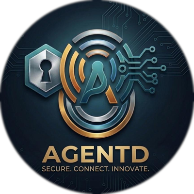

<!-- Last updated: 2026-03-22. If you change the project setup, commands, or architecture — update this file in the same PR. -->

<div align="center">



# Claude Agent SDK for Go

[](https://go.dev/)
[](LICENSE)

> Part of [**AgentD**](https://github.com/hishamkaram/agentd-workspace) — remote control for AI coding agents with E2E encryption and mobile approval gates.

</div>

Go SDK for the Claude Code CLI subprocess protocol — spawns Claude Code as a child process, communicates via JSON lines, and provides a typed Go API for queries, multi-turn conversations, and tool use hooks.

## Why this component?

The SDK handles the messy details of communicating with Claude Code — subprocess management, JSON line parsing, and typed message streaming — so the daemon can focus on session orchestration. Without it, every consumer of Claude Code would need to reimplement process lifecycle management, the streaming control protocol, and the 23-event hook system from scratch.

## Feature highlights

| Feature | Value |
|---------|-------|
| **Typed Go API** | Work with `Message`, `ContentBlock`, and `HookEvent` structs instead of parsing raw JSON. The compiler catches protocol mismatches before runtime. |
| **23 hook event callbacks** | Intercept tool use, permission requests, session lifecycle, notifications, and more — all with strongly-typed input/output structs and a consistent callback pattern. |
| **One-shot and interactive modes** | `Query()` for fire-and-forget prompts that return a channel of messages. `Client` for multi-turn conversations with session persistence, resume, and fork. |
| **Zero external runtime deps** | Only `golang.org/x/net` at build time. No CGO, no gRPC, no framework overhead. The binary your daemon ships is self-contained. |

## Architecture

```
                         AgentD System
  +------------------------------------------------------------------+
  |                                                                    |
  |   Developer Machine               Cloud                Phone      |
  |  +------------------+     +------------------+  +--------------+  |
  |  |                  |     |                  |  |              |  |
  |  |  Claude Code     |     |   agentd-relay   |  |  agentd-web  |  |
  |  |       |          |     |   (dumb pipe)    |  |    (PWA)     |  |
  |  | *claude-agent-*  |     |                  |  |              |  |
  |  | *sdk-go*         |     +--------+---------+  +------+-------+  |
  |  |       |          |              |                   |          |
  |  |   agentd         +----- wss ---+---- wss ----------+          |
  |  |   (daemon)       |     E2E encrypted relay channel             |
  |  |       |          |                                             |
  |  |       +--- ws ---+------------------------------------ [PWA]  |
  |  |                  |     Direct local connection (LAN)           |
  |  +------------------+                                             |
  |                                                                    |
  +------------------------------------------------------------------+
```

The SDK sits at the bottom of the stack on the developer's machine. It spawns Claude Code as a subprocess, translates the JSON line protocol into typed Go channels, and exposes a clean API that the agentd daemon consumes for session management.

## What it does

- Spawns Claude Code CLI as a subprocess with `--agent --stdio` flags
- Streams typed messages (assistant output, tool use, errors, hooks) via channels
- Supports one-shot queries (`Query()`) and interactive multi-turn sessions (`Client`)
- Provides 23 hook event callbacks for intercepting tool use, permissions, and lifecycle events
- Handles MCP (Model Context Protocol) server configuration and tool routing

## Tech stack

- Go 1.24
- Zero external runtime dependencies (only `golang.org/x/net` for internal transport)
- Claude Code CLI (spawned as subprocess — must be installed separately)

## Prerequisites

- Go 1.24+
- Claude Code CLI installed: `npm install -g @anthropic-ai/claude-code`
- Authentication (one required):
  - `CLAUDE_API_KEY` environment variable (pay-as-you-go)
  - `CLAUDE_CODE_OAUTH_TOKEN` environment variable (Max subscription)

## Getting started

```bash
# Install the SDK
go get github.com/hishamkaram/claude-agent-sdk-go

# One-shot query
import claude "github.com/hishamkaram/claude-agent-sdk-go"

msgs := claude.Query(ctx, "Explain this Go code", claude.NewClaudeAgentOptions())
for msg := range msgs {
    // Process streamed messages
}

# Interactive client
client, _ := claude.NewClient(ctx, claude.NewClaudeAgentOptions())
defer client.Close()
client.Connect()
response := client.Query(ctx, "What files are in this directory?")
```

## Project structure

```
claude-agent-sdk-go/
├── query.go                # Query() — one-shot prompt → channel of messages
├── client.go               # Client — multi-turn interactive sessions
├── sessions.go             # Session management
├── types/                  # Public types (all exported)
│   ├── messages.go         # Message types, content blocks (text, tool_use, thinking, etc.)
│   ├── control.go          # 23 hook event types, hook callbacks, permission results
│   ├── options.go          # ClaudeAgentOptions builder (With* methods)
│   ├── errors.go           # Typed errors with predicate functions
│   ├── mcp.go              # MCP server config and tool types
│   ├── mcp_types.go        # MCP type definitions
│   └── session_types.go    # Session-related types
├── internal/
│   ├── transport/          # Subprocess CLI transport, CLI discovery, stream reader
│   │   ├── subprocess_cli.go  # Spawns Claude CLI, manages stdin/stdout pipes
│   │   ├── cli_version.go     # CLI version detection and validation
│   │   ├── cli_discovery.go   # CLI binary discovery
│   │   ├── stream.go          # JSON line reader with configurable buffer
│   │   └── transport.go       # Transport interface
│   ├── message_parser.go  # JSON to Go type conversion
│   ├── query.go            # Control protocol handler
│   └── log/                # Internal logging utilities
├── examples/               # Working examples
│   ├── simple_query/       # Basic one-shot query
│   ├── interactive_client/ # Multi-turn conversation
│   ├── with_permissions/   # Tool permission callbacks
│   ├── with_hooks/         # Hook event handling
│   ├── with_plugins/       # Plugin system example
│   ├── with_betas/         # Beta features example
│   ├── plugins/            # Plugin definitions
│   └── mcp_server_simple/  # MCP server example
├── Makefile                # build, test, test-all, lint, coverage
├── VERSION                 # 0.5.1
└── go.mod
```

## Available commands

| Command | Description |
|---------|-------------|
| `make build` | Build all packages |
| `make test` | Run unit tests (skips integration — no Claude CLI needed) |
| `make test-all` | Run all tests including integration (requires Claude CLI) |
| `make test-integration` | Run integration tests only |
| `make coverage` | Unit tests with coverage report |
| `make lint` | Run `go vet` + golangci-lint |
| `make fmt` | Format all Go files |

## Environment variables

| Variable | Required | Description |
|----------|----------|-------------|
| `CLAUDE_API_KEY` | One of these | Anthropic API key (pay-as-you-go) |
| `CLAUDE_CODE_OAUTH_TOKEN` | required | OAuth token (Max subscription) |
| `CLAUDE_AGENT_SDK_SKIP_VERSION_CHECK` | Optional | Skip Claude CLI version validation |

## How it connects to the rest of the workspace

- **agentd** — The daemon imports this SDK via `go get` with a workspace `replace` directive pointing to `../claude-agent-sdk-go`. Used in `agentd/internal/agents/claudecode.go` to spawn and manage Claude Code sessions.
- **agentd-relay** — No relationship. The SDK communicates locally with the Claude CLI subprocess.
- **agentd-web** — No relationship. The PWA communicates with the daemon, not the SDK.

## Known limitations / gotchas

- The SDK spawns Claude Code as a subprocess — it does not make direct API calls to Anthropic
- Requires Claude Code CLI v2.0.0+ (checked at connect time, skip with `CLAUDE_AGENT_SDK_SKIP_VERSION_CHECK=1`)
- `make test` runs in `-short` mode (no Claude CLI needed); `make test-all` spawns real Claude processes and requires authentication
- The module path is `github.com/hishamkaram/claude-agent-sdk-go` — the existing README references an old upstream path that is incorrect
- `v0.2.0` is retracted in go.mod — do not use that version

## Contributing

See the [Contributing Guide](../CONTRIBUTING.md) in the workspace root for development setup, coding standards, and submission process.

## License

[MIT](LICENSE)
